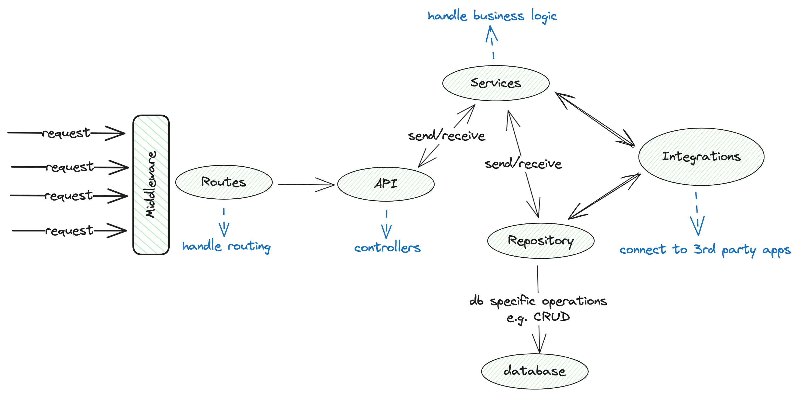

# Golang Repository Pattern with a Flat Domain-Driven Structure v1

A simple Golang repository pattern backend service providing RESTful APIs for managing users, and authentication through a flat structure approach.

Tools/Libraries involved:
- Golang
- PostgreSQL Database
- [pgx](https://github.com/jackc/pgx)
- [Sqlc](https://sqlc.dev)
- Docker and docker-compose

### Folder Breakdown

- `admin`: This folder contains modules responsible for handling admin operations.
  
- `api`: Also known as controllers, this folder serves as the input request's first point of contact after the routes. It contains modules that handle incoming HTTP requests, process them by sending to the appropriate service, and return appropriate responses. Each module typically corresponds to a specific endpoint or resource.

- `database`: This folder houses database-related files, including setup scripts, migration files, and database access code. It may also include SQL scripts for initializing the database schema and sqlc-generated Go type-safe codes for interacting with the database.

- `docs`: This folder contains documentation resources for the project, such as code structure diagrams, API documentation, and any other relevant documentation.

- `integrations`: This folder integrates third-party applications and services into the project. It may contain modules responsible for interfacing with APIs, SDKs, or libraries provided by external services like [Cloudinary](https://cloudinary.com), [Paystack](https://paystack.com), [Flutterwave](https://flutterwave.com), etc.

- `messages`: The messages folder handles responses and error messaging. It includes modules responsible for formatting and sending responses to clients and generating error messages for various scenarios.

- `middleware`: Middleware intercepts and processes incoming HTTP requests before they reach the application's main handlers. It includes modules for implementing functionalities such as CORS (Cross-Origin Resource Sharing), request logging, authentication, authorization, rate limiting, etc.

- `repository`: This folder contains modules responsible for the data-access layer of the application. It encapsulates database operations, including CRUD (Create, Read, Update, Delete) operations, query building, and data manipulation.

- `routes`: The routes folder defines application routes. It contains modules that map incoming HTTP requests to the appropriate controller methods based on the request's URL path and HTTP method.

- `server`: The server folder houses modules responsible for running the application. It initializes necessary components such as database connections, token management, repositories, services, controllers, and middleware. It is typically the main entry point of the application from the `main.go` file.

- `services`: This folder contains modules that bridge the gap between controllers (from the `api` folder) and the repository. Services encapsulate business logic, orchestrate interactions between different components, and perform complex operations involving multiple data entities.

- `token`: The token folder manages JWT (JSON Web Token) operations. It includes modules for creating, verifying, and managing JWT tokens used for authentication and authorization purposes.

- `util`: The util folder contains utility modules that provide common functionalities used across the project. It includes modules for handling environmental configuration, password hashing, date/time formatting, random data generation etc.

- `validators`: This folder handles validation for user inputs. It includes modules for validating request payloads, ensuring that incoming data meets specific criteria or constraints before processing them further.

This expanded description provides a clearer understanding of the purpose and responsibilities of each folder within the project structure.

## Diagramatic structure
A basic system design depicting the application structure:



## Features

- User registration
- User authentication
- Token-based authentication using JWT
- User management (CRUD operations)

## API Endpoints

### Authentication

#### Register User

- `POST /v1/auth/register`
  - Register a new user
  - Request Body:
    ```json
    {
        "firstname": "John",
        "lastname": "Doe",
        "email": "john@example.com",
        "password": "password123"
    }
    ```
  - Response:

    Status: 201 Created

    ```json
    {
    "status": true,
    "data": {
        "id": 1,
        "firstname": "John",
        "lastname": "Doe",
        "email": "john@example.com",
        "token": "<JWT_TOKEN>",
        "created_at": "0001-01-01T00:00:00Z",
        "updated_at": "0001-01-01T00:00:00Z"
    },
    "error": [],
    "message": "operation was successful"
    }
    ```

#### Login User

- `POST /v1/auth/login`
  - Login with existing credentials
  - Request Body:
    ```json
    {
        "email": "john@example.com",
        "password": "password123"
    }
    ```
  - Response:

    Status: 200 OK

    ```json
    {
        "token": "<JWT_TOKEN>"
    }
    ```

### User Management

#### Get User Profile

- `GET /v1/users/:id`
  - Get user profile by ID
  - Response:

    Status: 200 OK

    
    ```json
    {
        "id": 1,
        "firstname": "John",
        "lastname": "Doe",
        "email": "john@example.com"
    }
    ```

#### Update User Profile

- `PUT /v1/users/:id`
  - Update user profile by ID
  - Request Body:
    ```json
    {
        "firstname": "John",
        "lastname": "Doe",
        "email": "john@example.com"
    }
    ```
  - Response:

    Status: 200 OK

    
    ```json
    {
        "id": 1,
        "firstname": "John",
        "lastname": "Doe",
        "email": "john@example.com"
    }
    ```

#### Delete User

- `DELETE /v1/users/:id`
  - Delete user by ID
  - No request body
  - No response body, status code 204 on success

## Setup

### Dependencies

- Go 1.16+
- PostgreSQL

### Configuration

1. Copy `.env.example` to `.env` and update with your configuration.

### Build and Run

1. Install dependencies:
   ```bash
   go mod tidy
   ```
2. Build the binary:
   ```bash
   go build -o goRepositoryPattern
   ```
3. Run the server:
   ```bash
   ./goRepositoryPattern
   ```

## Environment Variables

- `DB_DRIVER`: Database driver (e.g., postgres)
- `DB_USER`: Database username
- `DB_PASSWORD`: Database password
- `DB_NAME`: Database name
- `DB_HOST`: Database host
- `DB_PORT`: Database port
- `JWT_SECRET`: Secret key for JWT

## Contributing

Pull requests are welcome. For major changes, please open an issue first to discuss what you would like to change.

## License

[MIT](LICENSE)